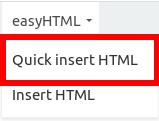
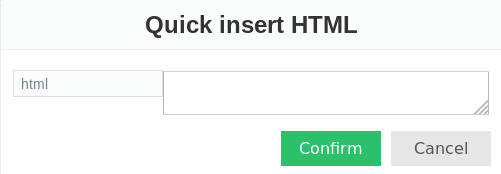
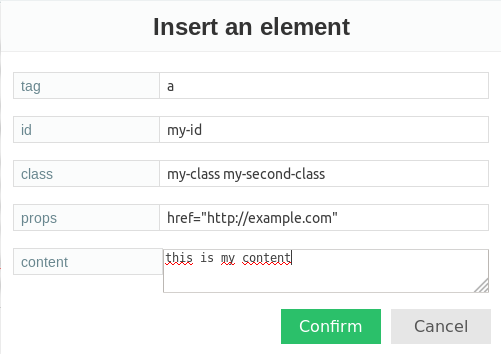
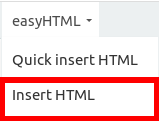
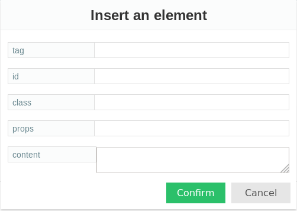
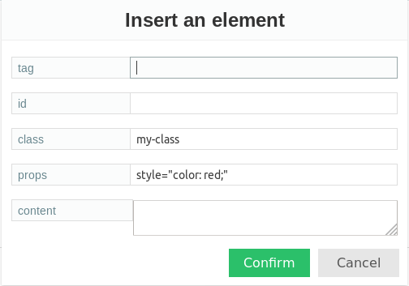
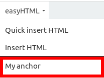
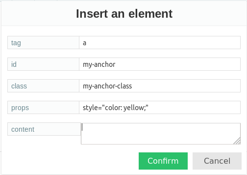
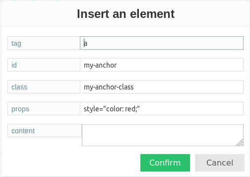
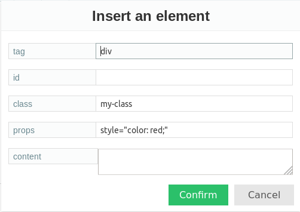

# Trumbowyg EasyHTML Plugin

Trumbowyg EasyHTML Plugin (TEP) is a plugin for trumbowyg that let you insert HTML code in an easy way.


## Insertion modes

You can insert HTML code with TEP in two ways:

### Quick insert

With this mode you can insert HTML directly to Trumbowyg editor:





### Form insert

TEP displays an insert modal form that let you define the parameters of the insertion:
* **tag**: The name for the element, e.g., `a`, for an anchor element
* **id**: The id for the element, e.g.,: `my-id`
* **class**: The class or classes for the element, e.g., `my-class my-second-class`
* **props**: Other properties for the element, : `href="http://example.com"`
* **content**: The content for the element, ie: `this is my content`



This will add the following element:
```html
<a id="my-id" class="my-class my-second-class" href="http://example.com">
    This is my content
</a>
```

You can use this mode with the *Insert HTML* button or with *Templates*.

#### Insert HTML button



This button will open the insert modal form for inserting data with blank information:



**Global values**

You may predefine all (or just some of them) values for the insert modal form fields for every time you open it. To do so, you must define global values in the configuration passed on trumbowyg init:

```js
// Define trumbowyg parameters
var configuration = {
    plugins: {
        easyHTML: {
            defaults : {
                tag: 'a',
                id: 'my-id',
                class: 'my-class',
                props: 'style="color: red;"',
                content: 'my-content'
            },
        }
    }
}

// Or predefine some values only
var configuration = {
    easyHTML: {
        plugins: {
             defaults : {
                class: 'my-class',
                props: 'style="color: red;"'
            }
        }
    }
}

// Create a trumbowyg instance and pass previous created parameters
$('textarea').trumbowyg(configuration);
```

Now each time you click on the *Insert HTML* button, the insert modal form will have those values predefined:




#### Templates

In order to speed up HTML insertion, you can create templates. Templates let you predefine all (or some of them) values of the insert modal form.

Imagine you want to define a template for:
* an anchor `<a></a>` tag
* with id `my-anchor`
* with class `my-anchor-class`
* with style color `yellow`

In the configuration passed on trumbowyg init, you must define template parameters:
```js
// Define trumbowyg parameters
var configuration = {
    plugins: {
        easyHTML: {
            templates: {
                my_anchor: {
                    text: 'My anchor', // The text to be displayed in the button
                    values: { // The values to be predefined in the insert modal form for this template
                        tag: 'a',
                        id: 'my-anchor',
                        class: 'my-anchor-class',
                        props: 'style="color: yellow;"'
                    }
                }
            }
        }
    }
}

// Create a trumbowyg instance and pass previous created configuration
$('textarea').trumbowyg(configuration);
```

Then, in easyHTML drop down button, it will appear the template:



On click, it will display the insert modal form with the predefined values in your template:




## Predefined values

As you have seen above, TEP let you predefine values for the insert modal form:

* **Global values**: These values will be predefined in insert modal form every time you open it.

* **Templates**: These values will be predefined in insert modal form, but unlike *Global values*, just when you select that template in easyHTML drop down.


Although *Global values* and *Templates* can be used to predefine values in the insert modal form, there is a difference in their precedence. *Global values* are merged and overwritten by *Templates*.

Imagine the following example:
```js
 var configuration = {
    plugins: {
        easyHTML: {
            defaults : {
                class: 'my-class',
                props: 'style="color: red;"',
            },
            templates: {
                my_anchor: {
                    text: 'My anchor',
                    values: {
                        tag: 'a',
                        id: 'my-anchor',
                        class: 'my-anchor-class',
                    }
                },
                my_div: {
                    text: 'My div',
                    values: {
                        tag: 'div'
                    }
                }
            }
        }
    }
}

// Create a trumbowyg instance and pass previous created configuration
$('textarea').trumbowyg(configuration);
```

On click on the *Insert HTML* button, the insert modal form will be predefined the with *Global values*:


On click on the *My anchor* template button, the insert modal form will be predefined with *Global values* merged and overwritten by particular template values. In this example, `class` is overwritten (as is the only value repeated) while the rest of values are merged:



Finally, on click on the *My div* template button, the insert modal form will be predefined with values merged from *Global values* and particular template values:

